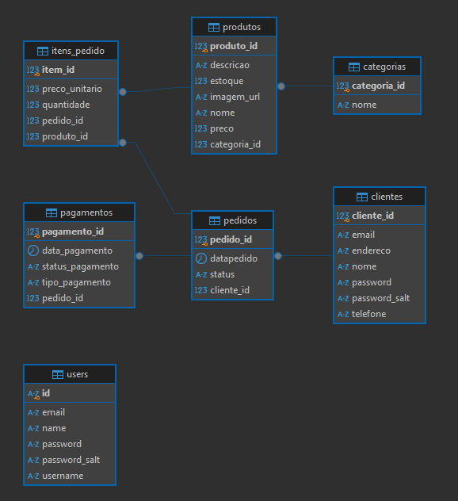

# README: Estrutura do Banco de Dados para E-commerce de Cupcakes

## DER - Diagrama Entidade Realacionamento

## Tabelas do Banco de Dados

### 1. Tabela `categorias`
**Descrição**: Armazena as categorias dos cupcakes para organização e filtragem.
- **`categoria_id`** (SERIAL, PK): Identificador único da categoria.
- **`nome`** (VARCHAR): Nome da categoria.

### 2. Tabela `produtos`
**Descrição**: Armazena os produtos disponíveis para venda.
- **`produto_id`** (SERIAL, PK): Identificador único do produto.
- **`nome`** (VARCHAR): Nome do produto.
- **`descricao`** (TEXT): Descrição detalhada do produto.
- **`preco`** (DECIMAL): Preço do produto.
- **`estoque`** (INT): Quantidade em estoque.
- **`categoria_id`** (INT, FK): Referência à tabela `categorias`.
- **`imagem_url`** (VARCHAR): URL da imagem do produto.

### 3. Tabela `clientes`
**Descrição**: Contém as informações dos clientes.
- **`cliente_id`** (SERIAL, PK): Identificador único do cliente.
- **`nome`** (VARCHAR): Nome do cliente.
- **`email`** (VARCHAR, UNIQUE): Endereço de e-mail único do cliente.
- **`senha`** (VARCHAR): Senha do cliente (armazenada de forma segura).
- **`endereco`** (TEXT): Endereço do cliente.
- **`telefone`** (VARCHAR): Número de telefone do cliente.

### 4. Tabela `pedidos`
**Descrição**: Armazena as informações sobre os pedidos realizados.
- **`pedido_id`** (SERIAL, PK): Identificador único do pedido.
- **`cliente_id`** (INT, FK): Referência à tabela `clientes`.
- **`data_pedido`** (TIMESTAMP): Data e hora do pedido.
- **`status`** (VARCHAR): Status do pedido (e.g., Pendente, Enviado).

### 5. Tabela `itens_pedido`
**Descrição**: Armazena os itens de cada pedido.
- **`item_id`** (SERIAL, PK): Identificador único do item no pedido.
- **`pedido_id`** (INT, FK): Referência à tabela `pedidos`.
- **`produto_id`** (INT, FK): Referência à tabela `produtos`.
- **`quantidade`** (INT): Quantidade do produto no pedido.
- **`preco_unitario`** (DECIMAL): Preço unitário do produto no momento do pedido.

### 6. Tabela `pagamentos`
**Descrição**: Armazena as informações sobre os pagamentos realizados.
- **`pagamento_id`** (SERIAL, PK): Identificador único do pagamento.
- **`pedido_id`** (INT, FK): Referência à tabela `pedidos`.
- **`tipo_pagamento`** (VARCHAR): Método de pagamento (e.g., Cartão de Crédito, Boleto).
- **`status_pagamento`** (VARCHAR): Status do pagamento (e.g., Aprovado, Pendente).
- **`data_pagamento`** (TIMESTAMP): Data e hora do pagamento.

## Relacionamentos
- A tabela `produtos` se relaciona com a tabela `categorias` por meio da chave estrangeira `categoria_id`.
- A tabela `pedidos` se relaciona com a tabela `clientes` por meio da chave estrangeira `cliente_id`.
- A tabela `itens_pedido` se relaciona com as tabelas `pedidos` e `produtos` por meio das chaves estrangeiras `pedido_id` e `produto_id`, respectivamente.
- A tabela `pagamentos` se relaciona com a tabela `pedidos` por meio da chave estrangeira `pedido_id`.